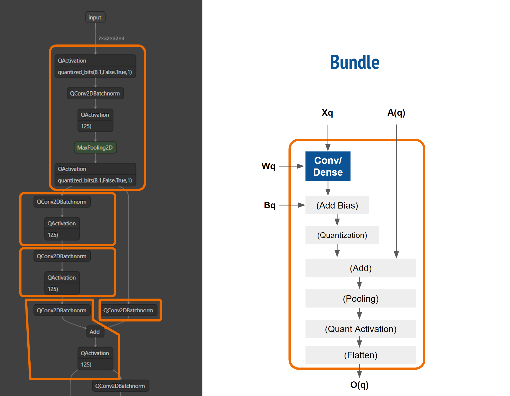

# AXI-Stream Universal DNN Engine

[HLS4ML](https://github.com/fastmachinelearning/hls4ml) is an open source python framework that's being widely adopted by the scientific community, to generate FPGA & ASIC implementations of their custom Deep Neural Networks. However, it is not possible to implement deeper neural networks on HLS4ML since it implements one engine per layer in hardware. This project aims to solve that problem and enhance HLS4ML, by creating a statically & dynamically reconfigurable, AXI-Stream DNN engine.

* This repository is tested through an [automated CI/CD pipeline](https://github.com/abarajithan11/dnn-engine/actions):  
* For more details, such as the features of our accelerator, details of the submodules, project documents, [browse our wiki](https://github.com/abarajithan11/dnn-engine/wiki)


## Quick Start (Linux)


1. Install [Icarus Verilog](https://github.com/steveicarus/iverilog) for verification, Pytest for parametrized testing, and Qkeras + Tensorflow + Numpy to quantize and manipulate DNNs.
```
sudo apt install -y --no-install-recommends iverilog
pip install pytest numpy tensorflow qkeras
```

2. Generate parameters for following steps & run the parametrized test:
```
cd test
python -m pytest -s py/param_test.py
```

3. FPGA implementation:
Open Xilinx Vivado, cd into the project root, and type the following in TCL console
```
cd fpga
source scripts/vivado.tcl
```

4. ASIC implementation with Cadence Genus & Innovus:

4.1. Add your PDK to `asic/pdk` and change paths in the scripts

4.2. Synthesis
```
mkdir asic/work
cd asic/work
genus ../scripts/run_genus.tcl
```

4.3. Place & Route
```
cd asic/work
genus ../scripts/run_pnr.tcl
```

## Overall Workflow

- One or more Qkeras models are first converted into an intermediate representation: a chain of Bundles. Each bundle is a group of layers such as Conv2D/Dense, Maxpool, Activation, Quantization, and Residual Add.
- The number of ROWS & COLS of processing elements can be freely chosen to fit a given FPGA or to meet certain area of silicon.
- The bundles are analyzed, and a set of synthesis parameters are generated. These are saved as .svh, .tcl, and .h headers. Controller code (C / Python) is generated for each model
- The project is synthesized, placed, and routed using given TCL scripts for those synthesis parameters using Cadence tools (ASIC) or Xilinx Vivado (FPGA)
- Randomized Verification: Our test suite generates random inputs, builds test vectors, and invokes a simulator: xsim, Icarus Verilog or Xcelium, randomly toggling bus signals to ensure correct behavior. The output vector is compared with the expected vector.
- Gate-level verification is done using same test suit
- Realization (ASIC tape out steps or FPGA programming steps)
- Controller code is programmed into the chip and tested



## Repository Structure

- asic - contains the ASIC workflow
  - scripts
  - work
  - pdk
  - reports
  - outputs
- fpga - contains the FPGA flow
  - scripts
  - projects
- rtl - contains the systemverilog design of the accelerator
- test
  - py - python files to parse the model, build bundles, and the pytest module for parametrized testing
  - sv - randomized testbenches (systemverilog)
  - vectors - generated test vectors
  - waveforms - generated waveforms

## Team Members

- Aba
- Zhenghua
- Anshu


## Results

### Results for 8 bit

The dataflow and its implementation results in 5.8× more Gops/mm2, 1.6× more Gops/W, higher MAC utilization & fewer DRAM accesses than the state-of-the-art (TCAS-1, TCOMP), processing AlexNet, VGG16 & ResNet50 at 336.6, 17.5 & 64.2 fps, when synthesized as a 7mm^2 chip usign TSMC 65nm GP.


Performance Efficiency (PE utilization across space & time) and number of DRAM accesses:


