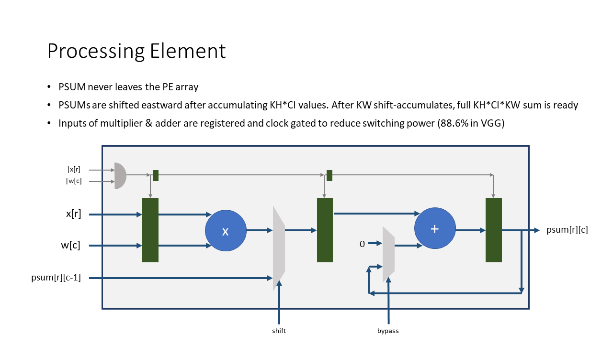
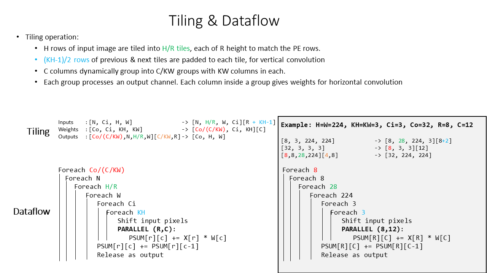
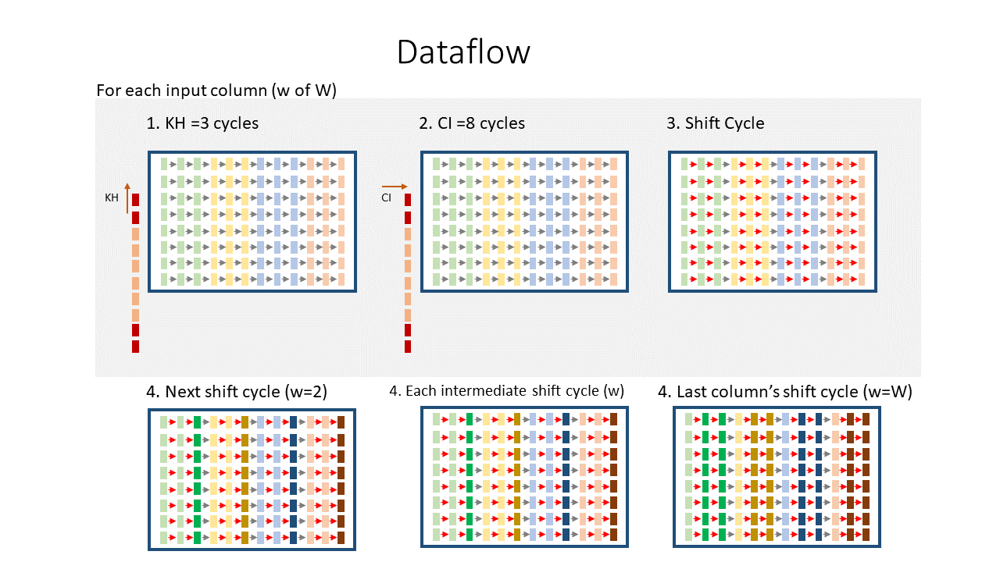

# AXI-Stream Universal DNN Engine (with Novel Dataflow enabling 70.7 Gops/mm2 on TSMC 65nm GP for 8-bit VGG16)

## Table of Contents
- [Overview](#overview)
  - [Current Features](#features)
  - [Modules](#modules)
- [Team members](#members)
- [Getting Started](#gettingstarted)
  - [System Requirements](#requirements)
  - [Steps to Install](#install)
- [How to use](#usage)
- [Repository Structure](#structure)
- [Results](#results)
- [Project Documents](#documents)
- [References](#references)

##  Overview

Developed as a self-motivated project, this repository contains the implementation of an ASIC/FPGA engine with a novel dataflow that eliminates the need for scratchpad SRAMs inside processing elements (PEs) to perform convolutions of DNNs, which results in high compute density and energy efficiency. The dataflow also maximizes data reuse of all outputs, weights and inputs to minimize DRAM accesses and maximize utilization.

The design is hierarchical & highly parametrized. Any kind of multiplier and adder (int, float, binary...etc.) with any size can be simply plugged into the design to reap above benefits of the dataflow. Zero-overhead dynamic reconfigurability between DNN layers is a key feature of this architecture.

###  Current Features

##### AXI Stream Design

* Every submodule is designed as an AXI Stream unit. This helps with modularity & ease of pipelining, resulting in a high Fmax. The system and its subsystems are also able to handle the backpressure and unpredictable availability of data from the DRAM this way.

##### Distributed Controller

* Systems with a central controller, controlled by an ISA pose multiple issues. Such systems need to wait for the pipeline to clear out, stop the execution and reconfigure everything, wasting clock cycles. Also, such central controllers pose routing issues since they need to be connected to all parts of the circuit. 

* Here, the control is decentralized. A header of few configuration bits is sent along the datapath itself, which is received at various stages of the pipelined design to reconfigure those stages locally, on-the-fly within one clock. This eliminates the need to flush the entire pipeline to process a different layer or a new DNN with different size. PEs dynamically regroup to processes different kernel sizes optimally.

##### PE Design

* A processing element here consists of only a multiplier, adder and pipeline registers. Partial sums are kept only inside accumulators through the entire processing, to produce an output pixel. No SRAMs are needed to store partial sums.
* Inputs to multiplier and adder come from clock-gated registers, which prevent switching when (1) master is invalid, (2) slave is not ready & data needs to be pushed, (3) either weight or input is zero, resulting in zero. (3) stops switching in 86% of the computations of a 4-bit VGG16 network trained for 80% weight sparsity, achieving 90% accuracy in CIFAR10.

##### Dataflow

* A unique, universal dataflow accommodates all convolution, fully-connected layers and matrix products into a single datapath. 
* The dataflow eliminates need for partial sum SRAMs, saving area. It also eliminates the need for multiple datapaths, saving resources.
* Primarily output stationary, since data movement of outputs is minimized. Weight stationary wrt system, as weights are fetched once and reused thousands of times. Inputs are reused in both dimensions of spatial convolution.

##### Verification

* Constrained random verification using custom SystemVerilog classes to drive AXI-Stream data in and out of the system.
* Python code to perform tiling, generate test vectors and compare the outputs.

###  Modules

The engine is implemented as a pipelined AXI-stream module that contains the following AXI-stream submodules.

##### 1. PE Array 

* Systolic array, consists of RxC processing elements.
* Each PE is made of just a multiplier, accumulator and a two-way multiplexer. 
* PEs dynamically regroup to processes different kernel sizes optimally.
* Output pixels are kept within the accumulator itself, without needing SRAM buffers, increasing compute density.
* This makes the engine primarily output-stationary.

##### 2. Weights Rotator 

* Ping-pong buffer of two large global SRAMs, that hold the weights.
* Weights from read_ram are fed into the PE array cyclically, maximizing weight reuse.
* Data is reused along the CIN (channel in) & KH (horizontal convolution) dimensions here.
* This makes the engine secondarily weight-stationary.
* Configuration headers are processed here in one clock and a few bits are appended to the TUSER field.

##### 3. Pixel Shifter 

* Shift register array that holds the input activations/pixels and shift them along KH (vertical convolution)
* This makes the engine input-stationary to a degree.

##### 4. Output Pipe 

* A bank shift registers that reshape the data and send to the output according to the configuration bits.

##### 5. LeakyRelu + Requantization Engine 

* Tensorflow's quantization scheme is used for float32 -> int8.
* Weights are quantized per COUT (channel out dimension), and activations are quantized per layer.
* This requires complexity, to store and match the simplified scales & biases (float16) of outputs.
* This engine receives a header through datapath, of scales and biases and fill the SRAMs
* Values in SRAMs are read cyclically to requantize the outputs for next layer's input

##### 6. Maxpool

* Performs 2x2 and 3x3 maxpooling.

##  Team Members

- Aba
- Zhenghua
- Anshu

##  Getting Started

###  System Requirements

###  Steps to Install

##  How to Use

Step-by-step process of how I developed this is [documented here](https://aba-blog.xyz/dnn-to-chip-1/index.html).

##  Repository Structure

- asic - contains the ASIC workflow
  - scripts
  - work
  - pdk
  - reports
  - outputs
- fpga - contains the FPGA flow
  - scripts
  - projects
- rtl - contains the systemverilog design of the accelerator
- test
  - py - python files to parse the model, build bundles, and the pytest module for parametrized testing
  - sv - randomized testbenches (systemverilog)
  - vectors - generated test vectors
  - waveforms - generated waveforms

##  Results

### Results for 8 bit

The dataflow and its implementation results in 5.8× more Gops/mm2, 1.6× more Gops/W, higher MAC utilization & fewer DRAM accesses than the state-of-the-art (TCAS-1, TCOMP), processing AlexNet, VGG16 & ResNet50 at 336.6, 17.5 & 64.2 fps, when synthesized as a 7mm^2 chip usign TSMC 65nm GP.

Performance Efficiency (PE utilization across space & time) and number of DRAM accesses:

##  Project Documents

For more details of the project, follow the [wiki](https://github.com/abarajithan11/dnn-engine/wiki/Project-Overview)

Refer to the documents below for more updates:

- Project Overview:
- Project Specifications: [docs](https://docs.google.com/document/d/1SLFzM2F2xkEAeCaVlXb_mL__qlsh00V4NdrKU_GPpx8/edit?usp=sharing)
- Oral Project Update: [slides](https://docs.google.com/presentation/d/1nxLmAPG2kUTwhhrXPJDYdC7C3mT9WKun33MIMbAssnw/edit?usp=sharing)
- Milestone Report: [docs](https://docs.google.com/document/d/14m7N75ihOHTkv0wHUQPQmOVXP5_-LvZ2R20ssSd6q7A/edit?usp=sharing)
- Final Presentation: [slides](https://docs.google.com/presentation/d/1tAmeuLDXFYc_SYJKE8qdVKhcpzAkpnsUiwGj5PQBH5M/edit#slide=id.g24f18bc2da0_0_0)
- Final Report:

##  References

##  Contact Us

### Todo

- [x] Github Actions + iVerilog for automatic verification
- [ ] PyTest for parametrized testing
- [ ] Simplify parameters
- [ ] Refactor, simplify RTL design
- [ ] Fix Skid Buffer
- [ ] Remove weight datawidth converter
- [ ] Huffman Decoder for weights DMA
- [ ] Remove pixel pipe datawidth converter
- [ ] Run Length Decoder for Pixels Pipe
- [ ] Build FIFO
- [ ] Systolic Architecture

<!-- ## Analysis -->
