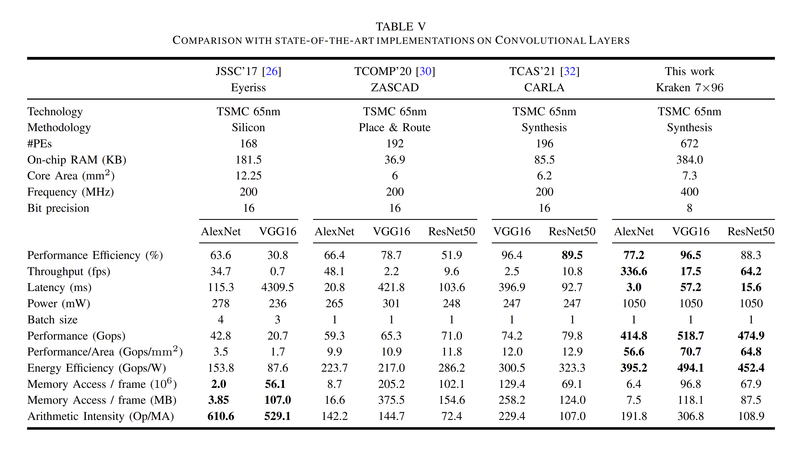
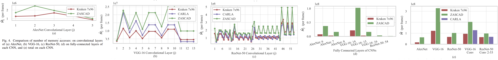
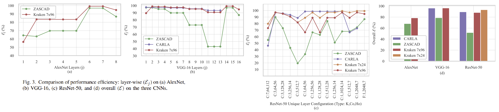

# AXI-Stream Universal DNN Engine
### with Novel Dataflow enabling 70.7 Gops/mm2 on TSMC 65nm GP for 8-bit VGG16

Developed as a self-motivated project, this repository contains the implementation of an ASIC/FPGA engine with a novel dataflow that eliminates the need for scratchpad SRAMs inside processing elements (PEs) to perform convolutions of DNNs, which results in high compute density and energy efficiency. The dataflow also maximizes data reuse of all outputs, weights and inputs to minimize DRAM accesses and maximize utilization.

The design is hierarchical & highly parametrized. Any kind of multiplier and adder (int, float, binary...etc.) with any size can be simply plugged into the design to reap above benefits of the dataflow. Zero-overhead dynamic reconfigurability between DNN layers is a key feature of this architecture.

Step-by-step process of how I developed this is [documented here](https://aba-blog.xyz/dnn-to-chip-1/index.html).

### Results for 8-bit

The dataflow and its implementation results in 5.8× more Gops/mm2, 1.6× more Gops/W, higher MAC utilization & fewer DRAM accesses than the state-of-the-art (TCAS-1, TCOMP), processing AlexNet, VGG16 & ResNet50 at 336.6, 17.5 & 64.2 fps, when synthesized as a 7mm^2 chip usign TSMC 65nm GP.

Performance Efficiency (PE utilization across space & time) and number of DRAM accesses:

## Reconfigurability

* Pre-synthesis: The design is statically configured through a set of options in the given tcl scripts such as number of rows & columns in PE array, bit widths of weights, inputs & outputs, maximum in & out channels...etc, which are used to calculate the right parameters for the RTL design. Optimal options for a given set of Deep Neural Network architectures can be obtained from the equations given in analysis section.

* Runtime: A header of few configuration bits is sent along the datapath, which is received at various stages of the pipelined design to reconfigure those stages locally, on-the-fly within one clock. This eliminates the need to flush the entire pipeline to process a different layer or a new DNN with different size. PEs dynamically regroup to processes different kernel sizes optimally.

## Modules:

The engine is implemented as a pipelined AXI-stream module that contains the following AXI-stream submodules.

#### 1. PE Array 

* Systolic array, consists of RxC processing elements.
* Each PE is made of just a multiplier, accumulator and a two-way multiplexer. 
* PEs dynamically regroup to processes different kernel sizes optimally.
* Output pixels are kept within the accumulator itself, without needing SRAM buffers, increasing compute density.
* This makes the engine primarily output-stationary.

#### 2. Weights Rotator 

* Ping-pong buffer of two large global SRAMs, that hold the weights.
* Weights from read_ram are fed into the PE array cyclically, maximizing weight reuse.
* Data is reused along the CIN (channel in) & KH (horizontal convolution) dimensions here.
* This makes the engine secondarily weight-stationary.
* Configuration headers are processed here in one clock and a few bits are appended to the TUSER field.

#### 3. Pixel Shifter 

* Shift register array that holds the input activations/pixels and shift them along KH (vertical convolution)
* This makes the engine input-stationary to a degree.

#### 4. Output Pipe 

* A bank shift registers that reshape the data and send to the output according to the configuration bits.

#### 5. LeakyRelu + Requantization Engine 

* Tensorflow's quantization scheme is used for float32 -> int8.
* Weights are quantized per COUT (channel out dimension), and activations are quantized per layer.
* This requires complexity, to store and match the simplified scales & biases (float16) of outputs.
* This engine receives a header through datapath, of scales and biases and fill the SRAMs
* Values in SRAMs are read cyclically to requantize the outputs for next layer's input

#### 6. Maxpool

* Performs 2x2 and 3x3 maxpooling.

<!-- ## Analysis -->