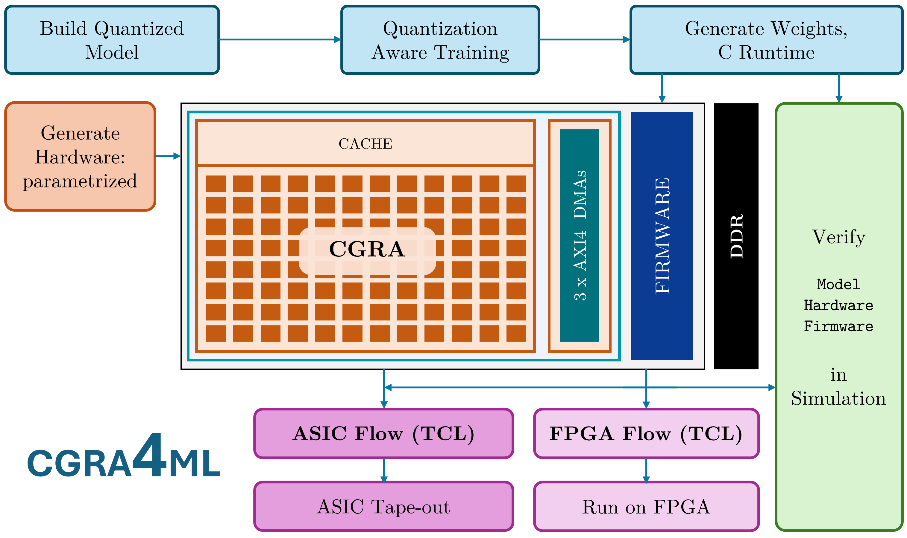
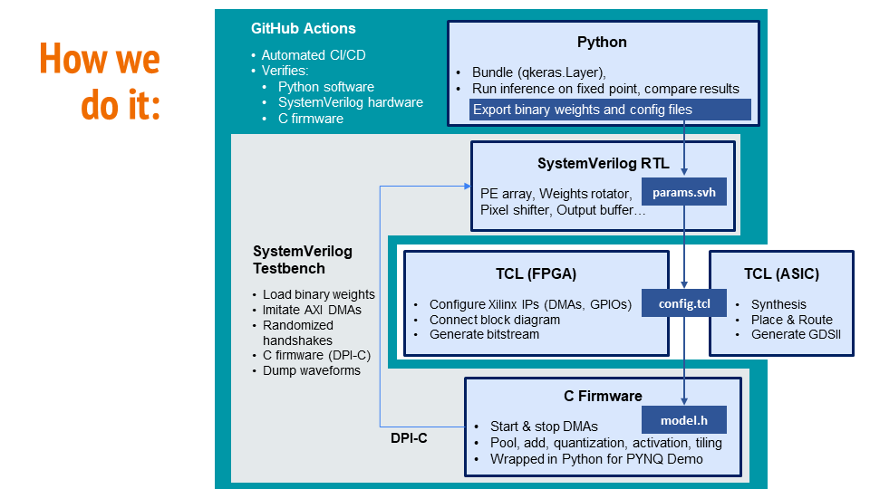

<!-- https://github.com/abarajithan11/deepsocflow/assets/26372005/113bfd40-cb4a-4940-83f4-d2ef91b47c91 -->

# CGRA4ML: A Framework to Implement Modern Neural Networks for Scientific Edge Computing  

cgra4ml is a Python library that helps researchers build, train, and implement their own deep ML models, such as ResNet CNNs, Autoencoders, and Transformers on FPGAs and custom ASIC.

It takes a lot of effort and expertise to implement highly optimized neural networks on edge platforms. The challenging aspects include:

- Designing an optimal dataflow architecture
- Building & verifying an accelerator, optimizing for high-frequency
- Building the System-on-Chip, verifying and optimizing data bottlenecks
- Writing C firmware to control the accelerator and verify its correctness

Often, after all that work, the models do not meet their expected performance due to memory bottlenecks and sub-optimal hardware implementation.

We present a highly flexible, high-performance accelerator system that can be adjusted to your needs through a simple Python API. The framework is maintained as open source, allowing a user to modify the processing element to their desired data type using customized architecture, easily expand the architecture to meet the desired performance, and implement new neural network models.

<p align="center">  </p>


## Execution API
```c
#define NDEBUG
#include "platform.h"
#include "deepsocflow_xilinx.h"

int main() {

  hardware_setup();
  xil_printf("Welcome to DeepSoCFlow!\n Store weights, biases & inputs at: %p; \n", &mem.w);

  model_setup();
  model_run();    // run model and measure time

  // Print: outputs & measured time
  Xil_DCacheFlushRange((INTPTR)&mem.y, sizeof(mem.y));  // force transfer to DDR, starting addr & length
  for (int i=0; i<O_WORDS; i++)
    printf("y[%d]: %f \n", i, (float)mem.y[i]);
  printf("Done inference! time taken: %.5f ms \n", 1000.0*(float)(time_end-time_start)/COUNTS_PER_SECOND);

  hardware_cleanup();
  return 0;
}
```

## Motivation

[HLS4ML](https://github.com/fastmachinelearning/hls4ml) is an open source python framework that's being widely adopted by the scientific community, to generate FPGA & ASIC implementations of their custom Deep Neural Networks. CERN has taped out chips with DNN compression algorithms to be used in LHC using HLS4ML. However, it is not possible to implement deeper neural networks on HLS4ML since it implements one engine per layer in hardware. This project aims to solve that problem and enhance HLS4ML, by creating a statically & dynamically reconfigurable, AXI-Stream DNN engine.


## Quick Start

0. You need either [Verilator 5.014+](https://verilator.org/guide/latest/install.html#git-quick-install) or XIlinx Vivado for simulation

1. Clone this repo and install deepsocflow
```bash
git clone https://github.com/KastnerRG/cgra4ml
cd cgra4ml
pip install .
```

2. Run the example
```bash
# Edit SIM and SIM_PATH in the file to match your simulator
cd run/work
python ../example.py
```

3. FPGA implementation:

<details>
  
<summary>Run Bare-metal on a ZYNQ FPGA</summary>

>3.1. Generate Bitstream from Vivado:
>```bash
># Make sure correct fpga board was specified in the above script. Default is ZCU102
># Open Xilinx Vivado, cd into deepsocflow, and type the following in TCL console
>cd run/work
>source vivado_flow.tcl
>```
>
>3.2 Run:
>- Open Xilinx Vitis
>- Create an application project, using `.xsa` generated by running the `run/work/vivado_flow.tcl`
>- Right click on application project -> Properties
>  - ARM v8 gcc compiler -> Directories -> Add Include Paths: Add absolute paths of `run/work` and `deepsocflow/c`
>  - ARM v8 gcc compiler -> Optimization -> Optimization most (-O3)
>  - ARM v8 gcc linker -> Libraries -> Add Library: `m` (math library)
>- Build, Connect board & launch debug
>- Add a breakpoint at `model_setup()`. When breakpoint hits, load `run/work/vectors/wbx.bin` to the address printed.
>- Continue - This will run the model and print outputs & execution time
</details>

<details>
<summary>Run in Linux on ZYNQ FPGA</summary>
  
>3.0. Setup: 
>- Linux SD Card Image: Download the AMD Linux SD card image for ZCU104 from [AMD Xilinx's downloads page](https://www.xilinx.com/support/download/index.html/content/xilinx/en/downloadNav/embedded-design-tools.html) (look for pre-built images for target board). Flash it to an SD card.
>- Insert the SD card into the board and connect a serial console. Ensure proper boot mode DIP switch positions. Turn on FPGA. First boot requires user to set password. Set a static IP on the FPGA to enable `scp`.
>  
>3.1. Generate bitstream from Vivado and edf overlay:
>```bash
>make hw
>```
>
>3.2. Build kernel: 
>```bash
># Clone kernel source and prepare build tree (required once)
>make kernel_prepare
>
># Build kernel module and packages relevant files in deploy/
>make linux
>```
>
>3.3. Deploy to Board: 
>Adjust `<user>` and `<board-ip>` to match your board's credentials.
>```bash
>scp deploy/ <user>@<board-ip>:
>```
>
>3.4. Run on the Board:
>```bash
>cd deploy
>
># 1. Load the firmware
>sudo mv cgra4ml-fw/ /lib/firmware/xilinx/
>sudo dfx-mgr-client -load cgra4ml-fw
>
># 2. Load the kernel driver
>sudo insmod cgra4ml_drv.ko
>
>#3. Run cross-compiled c example
>sudo ./linux_example
>
>#3 Run python example
>sudo python linux_eample.py
>
># Expected output:
># CGRA4ML Linux inference
>#   running inference...
>#
># --- output ---
># y[0]: 105/1000
># y[1]: 56/1000
># ...
>```
>
>3.5. Validate Output:
>- Compare the FPGA output against the Python golden reference:
>```bash
># On your host machine:
>cat run/work/vectors/y_exp.txt
>
># Example output (10 class probabilities):
># 0.105029
># 0.056218
># 0.056218
># 0.056218
># 0.056218
># 0.366587
># 0.056218
># 0.056218
># 0.134860
># 0.056218
>
># Multiply each probability by 1000 and truncate:
># int(0.105029 * 1000) = 105  → matches FPGA y[0]: 105/1000
># int(0.366587 * 1000) = 366  → matches FPGA y[5]: 366/1000
>```
>
>All 10 outputs should match exactly.
>
>See `deepsocflow/linux/driver/README.md` and `deepsocflow/linux/test/README.md` for detailed documentation.

</details>

4. Ibex SoC Integration

```
make image start enter     # build, start & enter docker container
# make kill                # kill and delete the container

# Inside the container
make smoke_ibex            # build, run ibex SoC simulation, verify outputs
```

5. ASIC implementation with Cadence Genus & Innovus:
```bash
# First add your PDK to 'asic/pdk', change paths in the scripts and run:
cd run/work
genus -f ../../tcl/asic/run_genus.tcl
innovus
source ../../tcl/asic/pnr.tcl
```

## Framework Infrastructure

<p align="center">  </p>


## Citation

If you use CGRA4ML in your research, please cite our paper:

```bibtex
@article{10.1145/3801097,
  author = {Abarajithan, G. and Ma, Zhenghua and Munasinghe, Ravidu and Restuccia, Francesco and Kastner, Ryan},
  title = {CGRA4ML: A Hardware/Software Framework to Implement Neural Networks for Scientific Edge Computing},
  year = {2026},
  publisher = {Association for Computing Machinery},
  address = {New York, NY, USA},
  issn = {1936-7406},
  url = {https://doi.org/10.1145/3801097},
  doi = {10.1145/3801097},
  journal = {ACM Trans. Reconfigurable Technol. Syst.},
}
```

## Team Members

- Aba
- Zhenghua
