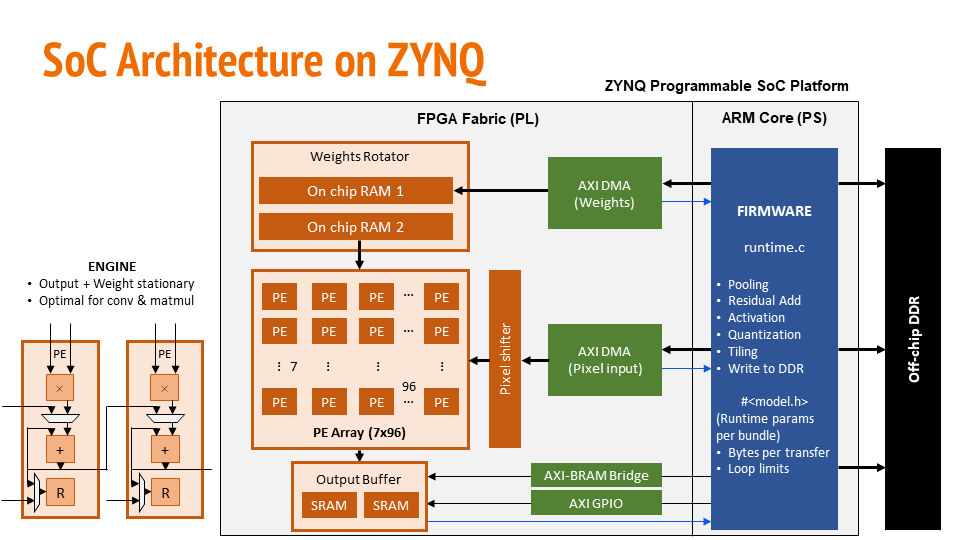

# DeepSoCFlow: DNNs to FPGA/ASIC SoCs in minutes  

Research groups around the world keep developing quantized DNNs to be accelerated on FPGAs or custom silicon, for new & exciting domain specific applications.

However, implementing your Deep Neural Networks on FPGA/ASIC and getting it working takes several painful months of 
- Building and training the model,
- Frontend software development to parse the model, 
- RTL design & verification of an accelerator, and 
- System-on-chip design & firmware development to optimally move data in & out of the accelerator.

We present a fully automated flow to do all this within minutes!



## Our Unified Flow

**1. Software**
- Build your model using our `Bundle` class, which contains Conv2D, Dense, Maxpool, Avgpool, Flatten layers
- Train your model with SOTA training algorithms

**2. Hardware**
- Specify your FPGA type or desired silicon area, and one or more models that you'd like to implement. This generates:
  - `hw.json` - hardware parameters
  - `params.svh` - SystemVerilog header to parameterize the accelerator
  - `config.tcl` - TCL header to parameterize Vivado project or ASIC flow
- FPGA: Run `vivado.tcl` to generate project, connect IPs, run implementation and generate bitstream
- ASIC: Connect PDKs and run `syn.tcl` and `pnr.tcl` to generate GDSII

**3. Firmware**
- `model.export(hw)`
  - Performs inference using integers and validates the model
  - Exports weights & biases as binary files
  - `model.h` - C header for the runtime firmware
  - Runs our randomized SV testbench to test your entire model through the hardware & C firmware
- FPGA Implementation:
  - Baremetal: Add our C files & `model.h` to Vitis project, compile & execute
  - PYNQ/Linux: Run our python runtime

## Motivation

[HLS4ML](https://github.com/fastmachinelearning/hls4ml) is an open source python framework that's being widely adopted by the scientific community, to generate FPGA & ASIC implementations of their custom Deep Neural Networks. CERN has taped out chips with DNN compression algorithms to be used in LHC using HLS4ML. However, it is not possible to implement deeper neural networks on HLS4ML since it implements one engine per layer in hardware. This project aims to solve that problem and enhance HLS4ML, by creating a statically & dynamically reconfigurable, AXI-Stream DNN engine.


## Quick Start

1a. Either [install Verilator 5.014+](https://verilator.org/guide/latest/install.html#git-quick-install) 

1b. Or install Xilinx Vivado, and set its path in `test/py/param_test.py` & set `sim='xsim'`

2. Install pytest for parametrized testing and Qkeras + Tensorflow + Numpy to quantize and manipulate DNNs.
```
pip install pytest numpy tensorflow qkeras
```

3. Generate parameters for following steps & run the parametrized test:
```
cd test
python -m pytest -s py/param_test.py
```

4. FPGA implementation:
Open Xilinx Vivado, cd into the project root, and type the following in TCL console
```
mkdir fpga/work
cd fpga/work
source ../scripts/vivado.tcl
```

5. ASIC implementation with Cadence Genus & Innovus:
First add your PDK to 'asic/pdk', change paths in the scripts and run:
```
mkdir asic/work
cd asic/work
genus -f ../scripts/run_genus.tcl
innovus
source ../scripts/pnr.tcl
```

## Repository Structure


- asic - contains the ASIC workflow
  - scripts
  - work
  - pdk
  - reports
  - outputs
- fpga - contains the FPGA flow
  - scripts
  - work
  - reports
  - outputs
- c - contains runtime firmware
- rtl - contains the systemverilog design of the engine
- test
  - py - python files build bundles, and the pytest module for parametrized testing
  - sv - randomized testbenches (systemverilog)
  - vectors - generated test vectors
  - waveforms - generated waveforms

## Team Members

- Aba
- Zhenghua

## Results


### Results for 8 bit

The dataflow and its implementation results in 5.8× more Gops/mm2, 1.6× more Gops/W, higher MAC utilization & fewer DRAM accesses than the state-of-the-art (TCAS-1, TCOMP), processing AlexNet, VGG16 & ResNet50 at 336.6, 17.5 & 64.2 fps, when synthesized as a 7mm^2 chip usign TSMC 65nm GP.


Performance Efficiency (PE utilization across space & time) and number of DRAM accesses:


