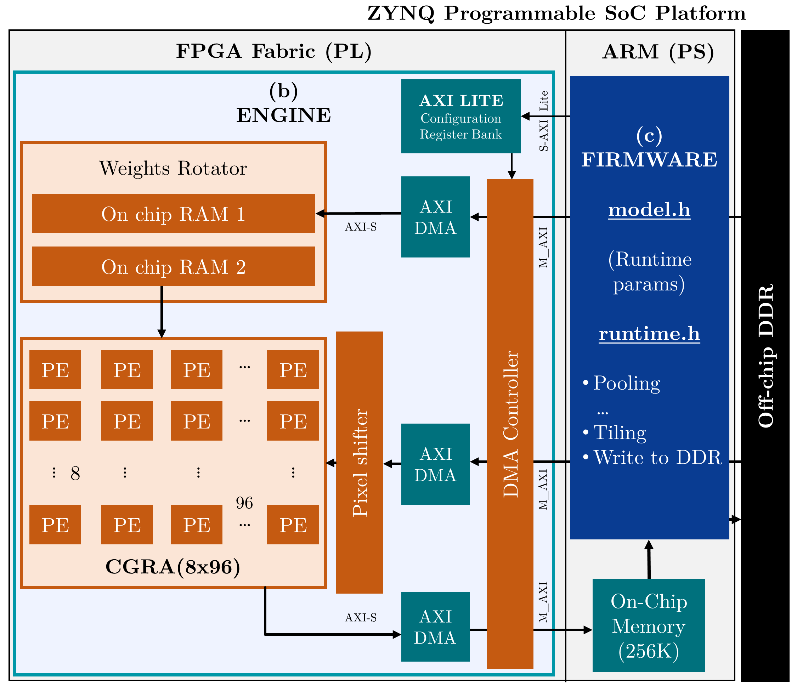
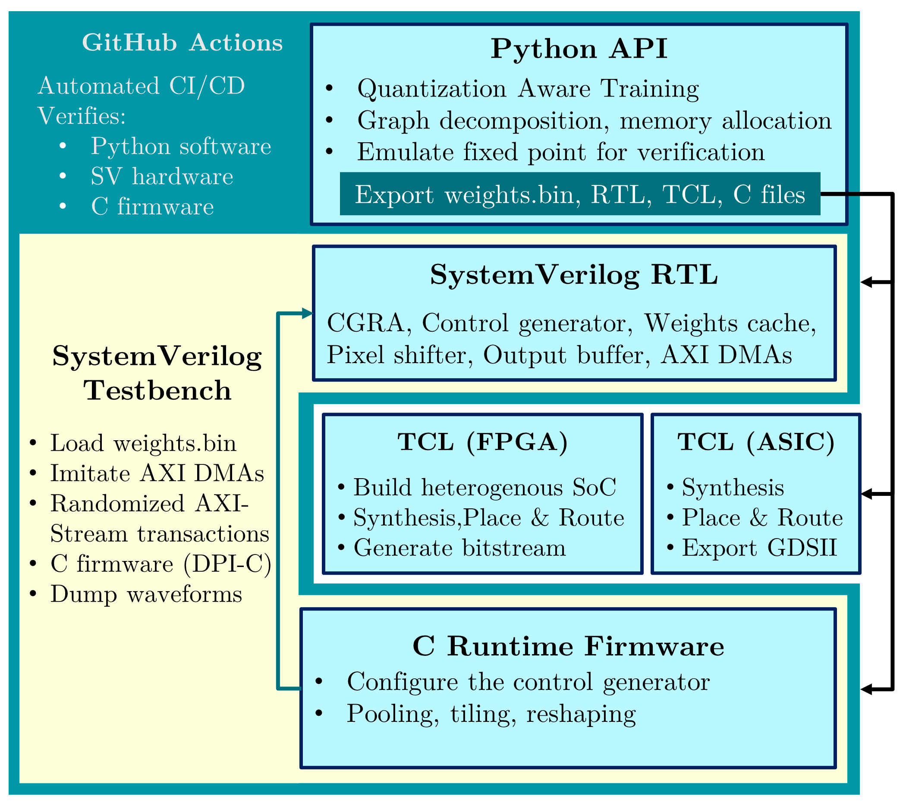

<!-- https://github.com/abarajithan11/deepsocflow/assets/26372005/113bfd40-cb4a-4940-83f4-d2ef91b47c91 -->

# An Open Framework to Empower Scientific Edge Computing with Modern Neural Networks  

cgra4ml is a Python library that helps researchers build, train, and implement their own deep ML models, such as ResNet CNNs, Autoencoders, and Transformers on FPGAs and custom ASIC.

It takes a lot of effort and expertise to implement highly optimized neural networks on edge platforms. The challenging aspects include:

- Designing an optimal dataflow architecture
- Building & verifying an accelerator, optimizing for high-frequency
- Building the System-on-Chip, verifying and optimizing data bottlenecks
- Writing C firmware to control the accelerator and verify its correctness

Often, after all that work, the models do not meet their expected performance due to memory bottlenecks and sub-optimal hardware implementation.

We present a highly flexible, high-performance accelerator system that can be adjusted to your needs through a simple Python API. The framework is maintained as open source, allowing a user to modify the processing element to their desired data type using customized architecture, easily expand the architecture to meet the desired performance, and implement new neural network models.

<p align="center">  </p>

## User API


```py
from deepsocflow import Bundle, Hardware, QModel, QInput

'''
0. Specify Hardware
'''
hw = Hardware (                          # Alternatively: hw = Hardware.from_json('hardware.json')
        processing_elements = (8, 96)  , # (rows, columns) of multiply-add units
        frequency_mhz       = 250      , #  
        bits_input          = 4        , # bit width of input pixels and activations
        bits_weights        = 4        , # bit width of weights
        bits_sum            = 16       , # bit width of accumulator
        bits_bias           = 16       , # bit width of bias
        max_batch_size      = 64       , # 
        max_channels_in     = 2048     , #
        max_kernel_size     = 13       , #
        max_image_size      = 512      , #
        ram_weights_depth   = 20       , #
        ram_edges_depth     = 288      , #
        axi_width           = 64       , #
        target_cpu_int_bits = 32       , #
        valid_prob          = 0.1      , # probability in which AXI-Stream s_valid signal should be toggled in simulation
        ready_prob          = 0.1      , # probability in which AXI-Stream m_ready signal should be toggled in simulation
        data_dir            = 'vectors', # directory to store generated test vectors
     )
hw.export() # Generates: config_hw.svh, config_hw.tcl, config_tb.svh, hardware.json
hw.export_vivado_tcl(board='zcu104')


'''
1. Build Model 
'''
XN = 1
input_shape = (XN,18,18,3) # (XN, XH, XW, CI)

QINT_BITS = 0
kq = f'quantized_bits({hw.K_BITS},{QINT_BITS},False,True,1)'
bq = f'quantized_bits({hw.B_BITS},{QINT_BITS},False,True,1)'
q1 = f'quantized_relu({hw.X_BITS},{QINT_BITS},negative_slope=0)'    
q2 = f'quantized_bits({hw.X_BITS},{QINT_BITS},False,False,1)'       
q3 = f'quantized_bits({hw.X_BITS},{QINT_BITS},False,True,1)'        
q4 = f'quantized_relu({hw.X_BITS},{QINT_BITS},negative_slope=0.125)'

x = x_in = QInput(shape=input_shape[1:], batch_size=XN, hw=hw, int_bits=QINT_BITS, name='input')

x = x_skip1 = Bundle( core= {'type':'conv' , 'filters':8 , 'kernel_size':(11,11), 'strides':(2,1), 'padding':'same', 'kernel_quantizer':kq, 'bias_quantizer':bq, 'use_bias':True , 'act_str':q1}, pool= {'type':'avg', 'size':(3,4), 'strides':(2,3), 'padding':'same', 'act_str':f'quantized_bits({hw.X_BITS},0,False,False,1)'})(x)
x = x_skip2 = Bundle( core= {'type':'conv' , 'filters':8 , 'kernel_size':( 1, 1), 'strides':(1,1), 'padding':'same', 'kernel_quantizer':kq, 'bias_quantizer':bq, 'use_bias':True , 'act_str':q2}, add = {'act_str':f'quantized_bits({hw.X_BITS},0,False,True,1)'})(x, x_skip1)
x =           Bundle( core= {'type':'conv' , 'filters':8 , 'kernel_size':( 7, 7), 'strides':(1,1), 'padding':'same', 'kernel_quantizer':kq, 'bias_quantizer':bq, 'use_bias':False, 'act_str':q3}, add = {'act_str':f'quantized_bits({hw.X_BITS},0,False,True,1)'})(x, x_skip2)
x =           Bundle( core= {'type':'conv' , 'filters':8 , 'kernel_size':( 5, 5), 'strides':(1,1), 'padding':'same', 'kernel_quantizer':kq, 'bias_quantizer':bq, 'use_bias':True , 'act_str':q4}, add = {'act_str':f'quantized_bits({hw.X_BITS},0,False,True,1)'})(x, x_skip1)
x =           Bundle( core= {'type':'conv' , 'filters':24, 'kernel_size':( 3, 3), 'strides':(1,1), 'padding':'same', 'kernel_quantizer':kq, 'bias_quantizer':bq, 'use_bias':True , 'act_str':q1},)(x)
x =           Bundle( core= {'type':'conv' , 'filters':10, 'kernel_size':( 1, 1), 'strides':(1,1), 'padding':'same', 'kernel_quantizer':kq, 'bias_quantizer':bq, 'use_bias':True , 'act_str':q4}, flatten= True)(x)
x =           Bundle( core= {'type':'dense', 'units'  :10,                                                           'kernel_quantizer':kq, 'bias_quantizer':bq, 'use_bias':True , 'act_str':q4}, softmax= True)(x)

model = QModel(inputs=x_in.raw, outputs=x)
model.compile()
model.summary()

'''
2. TRAIN (using qkeras)
'''
# model.fit(...)


'''
3. EXPORT FOR INFERENCE
'''
SIM, SIM_PATH = 'xsim', "F:/Xilinx/Vivado/2022.1/bin/" # For Xilinx Vivado
# SIM, SIM_PATH = 'verilator', "" # For Verilator

model.export_inference(x=model.random_input, hw=hw)  # Runs forward pass in float & int, compares them. Generates: config_fw.h (C firmware), weights.bin, expected.bin
model.verify_inference(SIM=SIM, SIM_PATH=SIM_PATH)   # Runs SystemVerilog testbench with the model & weights, randomizing handshakes, testing with actual C firmware in simulation

'''
4. IMPLEMENTATION

a. FPGA: Open vivado, source vivado_flow.tcl
b. ASIC: Set PDK paths, run syn.tcl & pnr.tcl
c. Compile C firmware with generated header (config_fw.h) and run on device
'''
```

## Execution API
```c
#define NDEBUG
#include "platform.h"
#include "deepsocflow_xilinx.h"

int main() {

  hardware_setup();
  xil_printf("Welcome to DeepSoCFlow!\n Store weights, biases & inputs at: %p; \n", &mem.w);

  model_setup();
  model_run();    // run model and measure time

  // Print: outputs & measured time
  Xil_DCacheFlushRange((INTPTR)&mem.y, sizeof(mem.y));  // force transfer to DDR, starting addr & length
  for (int i=0; i<O_WORDS; i++)
    printf("y[%d]: %f \n", i, (float)mem.y[i]);
  printf("Done inference! time taken: %.5f ms \n", 1000.0*(float)(time_end-time_start)/COUNTS_PER_SECOND);

  hardware_cleanup();
  return 0;
}
```

## Motivation

[HLS4ML](https://github.com/fastmachinelearning/hls4ml) is an open source python framework that's being widely adopted by the scientific community, to generate FPGA & ASIC implementations of their custom Deep Neural Networks. CERN has taped out chips with DNN compression algorithms to be used in LHC using HLS4ML. However, it is not possible to implement deeper neural networks on HLS4ML since it implements one engine per layer in hardware. This project aims to solve that problem and enhance HLS4ML, by creating a statically & dynamically reconfigurable, AXI-Stream DNN engine.


## Quick Start

0. You need either [Verilator 5.014+](https://verilator.org/guide/latest/install.html#git-quick-install) or XIlinx Vivado for simulation

1. Clone this repo and install deepsocflow
```bash
git clone https://github.com/abarajithan11/deepsocflow
cd deepsocflow
pip install .
```

2. Run the example
```bash
# Edit SIM and SIM_PATH in the file to match your simulator
cd run/work
python ../example.py
```

3. FPGA implementation:

3.1. Generate Bitstream from Vivado:
```bash
# Make sure correct fpga board was specified in the above script. Default is ZCU102
# Open Xilinx Vivado, cd into deepsocflow, and type the following in TCL console
cd run/work
source vivado_flow.tcl
```

3.2. Run on a ZYNQ FPGA:

- Open Xilinx Vitis
- Create an application project, using `.xsa` generated by running the `run/work/vivado_flow.tcl`
- Right click on application project -> Properties
  - ARM v8 gcc compiler -> Directories -> Add Include Paths: Add absolute paths of `run/work` and `deepsocflow/c`
  - ARM v8 gcc compiler -> Optimization -> Optimization most (-O3)
  - ARM v8 gcc linker -> Libraries -> Add Library: `m` (math library)
- Build, Connect board & launch debug
- Add a breakpoint at `model_setup()`. When breakpoint hits, load `run/work/vectors/wbx.bin` to the address printed.
- Continue - This will run the model and print outputs & execution time

4. ASIC implementation with Cadence Genus & Innovus:
```bash
# First add your PDK to 'asic/pdk', change paths in the scripts and run:
cd run/work
genus -f ../../tcl/asic/run_genus.tcl
innovus
source ../../tcl/asic/pnr.tcl
```

## Framework Infrastructure

<p align="center">  </p>


## Team Members

- Aba
- Zhenghua
